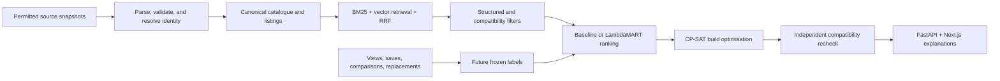

# PC Build Recommender

An evidence-backed search and recommendation system for complete desktop PC builds in
Singapore. It combines hybrid retrieval, deterministic compatibility rules, workload models,
learning-to-rank, and CP-SAT optimisation while keeping observed evidence, predictions, targets,
and development fixtures visibly separate.

Status: end-to-end development baseline. The core modules, API, web application, database
migration, ingestion adapters, training/evaluation harnesses, and optimiser exist. The repository
does **not** yet claim production retailer coverage or production-promoted supervised-model
quality. One real-data CPU development diagnostic exists, but it misses the promotion gates.

Public demo: [BuildSignal PC Recommender](https://buildsignal-pc-recommender.tendra425.chatgpt.site).
It serves the verified frontend and illustrative sample builds; live retailer stock and the
production FastAPI release are not connected yet.

## What is implemented



The implementation includes:

- typed schemas and SQLAlchemy persistence for eight component categories;
- content-addressed source snapshots, deterministic JSONL, manifests, and data-quality reports;
- a local-only Awin CSV/gzip adapter gated by an exact Ed25519-signed rights policy and externally
  pinned trust root (no downloader, API key, or bundled retailer feed);
- conservative entity-resolution blocking, numeric conflict gates, baselines, and LightGBM;
- release-bound BM25, Sentence-Transformers embeddings, reciprocal-rank fusion, database-backed
  filters, and LambdaMART;
- a durable two-reviewer annotation ledger, independent adjudication, and content-addressed
  relevance/entity-resolution exports;
- versioned `PASS` / `FAIL` / `WARNING` / `UNKNOWN` compatibility rules;
- observed-first workload modelling with grouped splits and confidence gates;
- OR-Tools CP-SAT profiles, diversity constraints, and exhaustive reduced-catalogue validation;
- atomic immutable LambdaMART bundle publication, a pinned offline semantic-encoder serving
  contract, and fail-closed catalogue/entity-resolution release authority;
- descriptive observed price intelligence exposed by FastAPI and the responsive Next.js flow; and
- PostgreSQL/pgvector, Alembic, Dagster, MLflow, Docker Compose, and CI scaffolding.

## Evidence snapshot - 2026-07-23

These are verified local artifacts, not roadmap targets:

| Evidence | Measured locally | Important boundary |
| --- | ---: | --- |
| BuildCores full catalogue | 25,666 accepted canonical-product records, 33 rejected | ODC-By 1.0 with attribution; every accepted row retains source-record and product provenance, but community specifications are not authoritative hard-compatibility evidence and contain no retailer prices. |
| Blender Open Data hash sample | 250,000 accepted observations | Deterministic sample selected after a complete scan of 422,319 submissions and 1,243,834 valid observations; benchmark version, scene, backend, and OS remain part of comparability. |
| MLPerf Inference v6 summary | 520 system results | Only 22 rows are flagged as potentially attributable to one accelerator. |
| Full product embedding index | 25,666 x 384 float32 vectors | `all-MiniLM-L6-v2` resolved to CUDA; this proves index construction, not retrieval quality. |
| Offline semantic encoder bundle (local) | 12 files, 91,580,262 bytes; verified offline CPU warm-up returns a normalized 384-vector and the pinned index fingerprint | Ignored operator artifact only, not a public model distribution or complete serving release. Catalogue, retailer-rights, ER, ranking, database, and deployment gates remain unmet. |
| Retailer catalogue gate | 485 controlled offers; 2 exact MPN+brand mappings; 0 known in stock | The other 483 offers remain unmatched. None has explicit data-use rights, so display, history, embedding, training, and production readiness remain blocked. |
| Retrieval silver diagnostic | 32 queries, 102,664 query-candidate rows | Predicate-generated labels with no human review. RRF NDCG@10 was 0.308534 versus 0.193411 for BM25. The run is non-promotable and no LambdaMART model was trained. |
| Blender CPU performance artifacts | v2 and legacy v3 revoked; corrected development diagnostic has post-selection R-squared 0.8763 and MAPE 18.98% on 30 held-out rows / 15 groups | The legacy artifacts inverted native `samples/minute` scores. The newer diagnostic is correct-target but still development-only, non-promotable, and above the 12% error gate; it cannot support a model-quality claim. |
| Blender GPU OPTIX pilot | 50 observed hardware rows across 36 families; LightGBM internal test R-squared -1.8538 and MAPE 203.52% on 6 rows / 5 families | A 4.5.0 / `junkshop` / OPTIX / Windows development diagnostic only. It is deliberately non-routable and non-promotable: the cohort is below the 100-family credibility minimum, rows are external-claim-ineligible, and every accuracy/calibration gate fails. |
| Blender 2026-07-23 temporal audit | 113 novel submissions and 339 novel observations; 0 rows matched the frozen Blender 4.0.0 / `junkshop` / CPU / Windows cohort | No inference, metric calculation, pooling, retraining, or promotion occurred. Status is `insufficient_external_cohort`; report semantic digest `95713915...44b`, file SHA-256 `e675a0d1...58cf`. |
| Compatibility generated sweep | 10,000 deterministic configurations; 526,300 assertions; 0 assertion failures or oracle mismatches | `compat_v2` engineering evidence only: zero observed market builds and zero retained per-scenario records. Expected outcomes included PASS, FAIL, and UNKNOWN cases. |
| CP-SAT build-output sweep | 10,000 retained complete outputs; 10,000 independent constraint checks; 340,000 `compat_v2` rule results, all PASS | Every retained output came from an actual OR-Tools solve and passed a separate oracle plus the versioned compatibility engine. Scenario-specific component IDs make output identity deterministic, so this is not evidence of market diversity or observed customer builds. |
| Zenodo ER transfer evaluation | 19,698 record-disjoint rows; held-out F1 0.777 and AP 0.817 | CC BY 4.0 external benchmark. It missed the precision/recall/F1 goals and is transfer-only, not evidence of Singapore retailer quality. |

Exact hashes, category counts, and eligibility rules are in [the data card](docs/data-card.md),
[source registry](data/source_registry.yaml), and [source guide](docs/data-sources.md). The current
[evaluation registry](docs/evaluation-report.md) deliberately leaves entity-resolution,
retrieval, ranking, regression, latency, and user-study targets unachieved until qualifying frozen
artifacts exist. Synthetic training diagnostics are software smoke tests only.

The corrected CPU cohort joins the full licensed BuildCores catalogue to the deterministic Blender
sample without fuzzy matching. Blender 4.0.0 / `junkshop` / CPU / Windows observations aggregate
to 172 hardware rows across 109 leakage groups. The source contract is explicitly
`samples/minute`, `higher_is_better=true`, and `samples_per_minute`; preparation preserves the
native median instead of inverting it. Because v2/v3 results were inspected before this correction
and no untouched external cohort exists, the corrected artifact is development-only and may emit
only labelled relative scores.

The separate Blender 4.5.0 / `junkshop` / GPU / OPTIX / Windows pilot has 50 observed hardware
rows across 36 product-family leakage groups. Its target is correctly oriented throughput
(`1000 / median_render_seconds`), but its group-disjoint LightGBM test has only 6 rows / 5 groups
and fails the accuracy and calibration gates (R-squared -1.8538, MAPE 203.52%). The sealed
artifact is development-relative-only and is not wired into API routing or the public demo. It is
negative evidence for this cohort, not a GPU-performance claim.

The [2026-07-23 temporal audit](artifacts/evaluation/performance-temporal-v4/957139150dbc1bbdd6deab1810b966ea59a33d9768b206e5033287c88a3f044b.json)
compared raw snapshot `c0f9d35c...af4833` with `67582ebc...93f5`. The new snapshot was a strict
superset, but none of its 339 novel observations satisfied the full frozen cohort identity,
including Blender build hash, benchmark-script version, and scene checksum. The audit therefore
records zero comparable rows and zero families, does not evaluate the model, and does not change
its promotion status. The retrospective protocol file is
`evals/performance/blender_cpu_content_creation_v4_external_protocol.json`, SHA-256
`6952cd7a220920fc9be882211577a67a67268a055e702e4b64955ada5123154a`.

The two primary data blockers are unchanged: supervised retrieval/ranking and PC-domain entity
resolution still need independently reviewed human labels, while priced build generation still
needs consented Singapore retailer feeds with explicit display, retention, derivation, and ML-use
rights plus known stock across all eight categories.

The repository now contains the operational machinery for both blockers, but not their external
inputs. `scripts/manage_annotations.py` persists two independent judgments, requires an independent
adjudicator for disagreements, and freezes immutable qrels or entity-resolution label releases.
`scripts/fetch_open_data.py --source awin_feed` can materialize an already-acquired local Awin
CSV/gzip only after verifying an exact signed policy. No independent human-label release, genuine
Awin feed, contractual grant, or production-promoted model is shipped, so none of those additions
changes the measured counts or model metrics above.

The guarded Zenodo Dn7 transfer run used source-record-disjoint train/validation/test splits of
15,951 / 1,945 / 1,802 pairs. At the validation-F1 threshold, CPU LightGBM achieved test precision
0.81102, recall 0.74638, F1 0.77736, and average precision 0.81666. A threshold selected for at
least 0.99 validation precision yielded 1.0 test precision but only 0.05072 recall. This is useful
transfer diagnostics, but it misses the operating targets and is not PC-retailer evidence.

## Windows quickstart

Prerequisites:

- Windows 11 with PowerShell 7;
- Python 3.12 and [`uv`](https://docs.astral.sh/uv/);
- Node.js 24 and npm; and
- Docker Desktop with the Linux engine running.

The repository pins Python in `.python-version` and Node in `.nvmrc`.

```powershell
uv sync --locked
npm install
./scripts/check-memory-cap.ps1 -MaxUsedGb 55
./scripts/dev.ps1 -Build -Detach
```

The memory preflight prints used/free/total RAM as JSON and exits nonzero when system usage is at
or above 55 GiB. Do not start Docker, model training, or another memory-heavy run when it fails.
Performance-model training independently reserves its conservative model allocation against the
same 55 GiB host cap and requires 1 GiB free headroom by default, recording that admission check
in the training report.
`dev.ps1` copies `.env.example` only when `.env` does not already exist; review those local-only
defaults before shared deployment.

Open:

- web: <http://localhost:3000>
- API documentation: <http://localhost:8000/docs>
- API readiness: <http://localhost:8000/health/ready>

Inspect or stop the stack:

```powershell
docker compose --env-file .env ps
./scripts/dev.ps1 -Down
```

Add `-WithDagster` and/or `-WithMlflow` to `dev.ps1` to enable the optional profiles. Dagster is
then available on port 3001 and MLflow on port 5000.

For host development without rebuilding containers, use two PowerShell terminals after the
initial dependency install:

```powershell
# Terminal 1
uv run --no-sync uvicorn services.api.main:app --reload --port 8000

# Terminal 2
npm run dev:web
```

`--no-sync` matters after enabling CUDA because an implicit dependency sync can restore the CPU
PyTorch wheel recorded in `uv.lock`.

### API data modes

The default `PCBR_API_SERVICE_MODE=demo` is a controlled contract fixture and is rejected outside
development/test environments. To inspect the processed real catalogue, set explicit paths before
starting FastAPI:

```powershell
$env:PCBR_API_SERVICE_MODE = "processed_catalog"
$env:PCBR_API_BUILDCORES_CATALOG_PATH = (Resolve-Path "data/processed/buildcores_open_db/f3ee75dd07ffdd7725da7b056229e0df12838c571b2372bd59563f3a79fd383f/portfolio-3000/records.jsonl").Path
$env:PCBR_API_GOVERNED_OFFERS_PATH = (Resolve-Path "data/processed/dynacore_controlled_pdf/6e243d7bf1cba090f529b09a9276fac03fedddcadb8c11cf9ce7ec1e674bb9ba/records.jsonl").Path
uv run --no-sync uvicorn services.api.main:app --reload --port 8000
```

This mode loads 3,000 products and 485 development-only offers, but conservative exact matching
currently maps only two offers and asserts zero items in stock. Product search works when
`in_stock_only` is false; complete priced build generation correctly returns infeasible. This is
intentional fail-closed behavior until reviewed mappings and consented sources cover all eight
categories. Optional development artifacts are configured with
`PCBR_API_REVIEWED_MAPPING_PATH` and `PCBR_API_REVIEW_EVIDENCE_PATH`. In a non-development
release, both are pinned inputs; review evidence is either rights-checked, cited evidence or an
explicit empty JSONL artifact, never uncited scraped prose.

## Verify the implementation

```powershell
./scripts/test.ps1 -Suite all
npm run test:e2e
docker compose --env-file .env.example config --quiet
```

`scripts/test.ps1` runs Ruff, strict mypy, pytest, ESLint, TypeScript, Vitest, and the Next.js
production build. Playwright is separate because it starts browser fixtures. These checks prove
implementation behavior; they do not establish model quality or market coverage.

For a controlled shared deployment, use the separate fail-closed production contract rather than
the local Compose file. See the [deployment runbook](docs/deployment-runbook.md),
[backup/restore policy](docs/backup-and-restore.md), and
[observability guide](docs/observability.md). These artifacts provide hardened configuration and
operator checks; production readiness still requires restore, load, ingress-authentication, alert,
and rollback drills.

## Use the local GPU safely

The lockfile intentionally resolves the portable CPU PyTorch wheel. Install the optional semantic
indexing dependencies first, then let the setup script replace PyTorch inside `.venv` with the
CUDA 13.0 build verified on the local RTX 5070 Ti:

```powershell
./scripts/check-memory-cap.ps1 -MaxUsedGb 55
uv sync --locked --extra embeddings
./scripts/setup-gpu.ps1
uv run --no-sync python -c "import torch; print(torch.__version__, torch.cuda.is_available(), torch.cuda.get_device_name(0))"
```

After this override, run Python commands with `uv run --no-sync ...` or directly with
`.venv\Scripts\python.exe`. A later `uv sync` restores the locked CPU wheel; rerun
`setup-gpu.ps1` afterward. The installed LightGBM wheel may still fall back to CPU if it was not
built with a supported GPU learner. Every model artifact records the requested device, actual
device, and fallback reason.

## Reproduce the open-data ingestion

The default command fetches only the three registered open sources. It does not fetch the
controlled Dynacore document or any retailer feed:

```powershell
uv run --no-sync python scripts/fetch_open_data.py `
  --source buildcores --source blender --source mlperf `
  --buildcores-profile portfolio --blender-limit 3000
```

The Blender archive is large, and parsing its JSONL stream requires substantial temporary disk
space. Existing local snapshots can be reused with the explicit archive arguments shown in
[the source guide](docs/data-sources.md). Every run writes `records.jsonl`, `rejections.jsonl`,
`manifest.json`, and `data-quality.json` under a raw-content hash.

The governed web path accepts only exact URLs named in a reviewed policy; it is not a discovery
crawler. It checks DNS confinement, robots, terms hashes, rights, resource limits, Schema.org
offers, currency, and Singapore shipping before writing. Complete processed runs are sealed in a
hidden staging area and atomically published, so a crash cannot expose a partial catalogue run:

```powershell
uv run --no-sync python scripts/fetch_open_data.py --source web_product `
  --web-policy-json path/to/reviewed-web-policy.json `
  --web-url https://approved.example/products/exact-reviewed-product
```

Scraping a shop page changes transport, not ownership: its prices and stock remain retailer-origin
data. The included research policy therefore keeps every observed offer out of the public site,
embeddings, training, ranking, and optimisation until explicit Singapore display, cache, history,
and derivation rights are recorded.

For an Awin product feed, acquisition is deliberately outside this application. An operator must
first obtain access and written downstream-use rights from Awin and the merchant, download the
feed without exposing its credential-bearing URL, create an exact source/category/host/rights
policy, sign it with Ed25519, and distribute an externally pinned trust root. The local importer
accepts no URL or API-key argument:

```powershell
uv run --no-sync python scripts/fetch_open_data.py --source awin_feed `
  --awin-feed C:\secure\feeds\merchant.csv.gz `
  --awin-policy-json C:\secure\policies\merchant-policy.json `
  --awin-policy-signature C:\secure\policies\merchant-policy.sig.json `
  --awin-trust-root C:\secure\policies\trust-root.json `
  --awin-trust-root-sha256 REPLACE_WITH_64_HEX_SHA256
```

The adapter streams bounded CSV/gzip input, uses disk-backed duplicate detection, rejects
credential-bearing URLs, and emits content-addressed raw/processed records plus an authorization
receipt. A signed `published_claims_eligible=true` additionally requires a distinct contractual
grant reference. XML, feed download, key management, retention execution, and production catalogue
approval remain operator responsibilities. The included tests use synthetic feeds only.

After installing the `embeddings` extra and applying the GPU override above, build the measured
CUDA embedding index from the portfolio slice:

```powershell
$PortfolioRecords = "data/processed/buildcores_open_db/f3ee75dd07ffdd7725da7b056229e0df12838c571b2372bd59563f3a79fd383f/portfolio-3000/records.jsonl"

uv run --no-sync python -m pc_build_recommender.retrieval.embedding_index `
  --input $PortfolioRecords `
  --output-dir artifacts/retrieval/buildcores-embeddings `
  --data-version buildcores-portfolio-3000-07e485e82333 `
  --encoder sentence-transformer `
  --model sentence-transformers/all-MiniLM-L6-v2 `
  --device cuda --batch-size 128
```

The output manifest records source and artifact hashes, text-builder and encoder versions, matrix
shape, normalization, and resolved device.

Production semantic serving is stricter than local index construction. The serving-release v2
manifest and operator configuration must agree on one local bundle path and SHA-256; the bundle
directory name must equal that digest, and its file count and byte count are also pinned. The API
loads it with `local_files_only=true` and offline Hugging Face/Transformers settings, then requires
a finite, nonzero, L2-normalized warm-up vector with the stored index dimension before readiness.
No production encoder-weight bundle is committed or publicly published here. Operators can create
an ignored local bundle only from an already verified snapshot, bind it to the exact embedding
manifest, and mount it in a complete pinned serving release:

```powershell
$EncoderSnapshot = "C:\secure\models\all-MiniLM-L6-v2\1110a243fdf4706b3f48f1d95db1a4f5529b4d41"
uv run --no-sync python scripts/package_semantic_encoder_bundle.py `
  --source $EncoderSnapshot `
  --output-root artifacts/serving/encoders `
  --model-name sentence-transformers/all-MiniLM-L6-v2 `
  --model-revision 1110a243fdf4706b3f48f1d95db1a4f5529b4d41 `
  --licence Apache-2.0 `
  --expected-source-sha256 0f4856ff5afd30b5b9cc9b3864c48d4daf24cbe9124bf2c7e21ceab6de297bf0 `
  --embedding-manifest artifacts/retrieval/buildcores-full-embeddings-pinned/manifest.json
```

The packager copies regular files only, records source/manifest provenance, verifies every byte,
then publishes one no-overwrite directory named after its own content hash. It does not relax the
catalogue, entity-resolution, ranking, retailer-rights, or database release gates.

## Train models

The shortest training smoke test is intentionally synthetic and permanently non-promotable:

```powershell
./scripts/check-memory-cap.ps1 -MaxUsedGb 55
uv run --no-sync python -m training.generate_starter_data

uv run --no-sync python -m training.train_entity_resolution `
  --input data/processed/starter/entity_resolution.synthetic.jsonl `
  --artifact-dir artifacts/models/entity-resolution/synthetic-smoke `
  --model all --device auto --allow-synthetic-diagnostics

uv run --no-sync python -m training.train_performance `
  --input data/processed/starter/performance_gpu.synthetic.csv `
  --artifact-dir artifacts/models/performance/synthetic-smoke `
  --device auto --allow-synthetic-diagnostics
```

Real training inputs must include row-level provenance, explicit synthetic flags, the correct
leakage-group columns, and a frozen external test set. Entity-resolution models require
independently labelled listing/product pairs. LambdaMART requires query-grouped 0-4 relevance
judgments. Performance models require comparable benchmark cohorts and product-family or
generation groups. See [the development guide](docs/development-guide.md) for the training and
promotion workflow. Training CLIs accept opt-in `--track-mlflow`; see
[the MLflow guide](docs/mlflow-tracking.md). Tracking never makes an otherwise ineligible run
promotable.

Human annotation is now durable rather than a spreadsheet convention. After applying Alembic
revision `20260723_0006`, a trusted wrapper supplies an upstream-verified OIDC identity artifact to
`scripts/manage_annotations.py`. The CLI provisions reviewers, creates/imports a blinded project,
leases tasks, records immutable decisions with hashed lease/idempotency material, independently
adjudicates disagreement, and freezes a content-addressed release. Relevance releases contain
`human-judgments.json`, `qrels.json`, and `query-split.json`; entity-resolution releases retain
both raw reviewer decisions and the final adjudication. The CLI does not validate JWTs itself, and
no qualifying human release currently exists.

Administrators can use `project-status --project-id <id>` to track aggregate collection progress,
lease health, adjudication backlog, and coarse freeze blockers without disclosing evidence,
decisions, reviewer identities, or lease secrets. It is an operational preflight; only
`freeze-project` performs the strict release validation.

For relevance collection, start with a **label-free** capture rather than a silver qrels file.
`scripts/capture_relevance_annotation_candidates.py` verifies a catalogue manifest, uses hybrid
candidate discovery, retains the fused RRF set plus a bounded round-robin union of
source-exclusive BM25 and vector candidates, and strips every rank, score, and source-membership
hint from the reviewer file. The same atomic capture writes a separate
`prelabel-features.jsonl`: its raw ranking inputs, feature matrix, candidate universe, catalogue,
query set, retrieval contract, and feature contract are hashed before annotation. The starter
query set is
[`evals/retrieval/buildcores-portfolio-annotation-queries.v2.json`](evals/retrieval/buildcores-portfolio-annotation-queries.v2.json).
Then `scripts/prepare_relevance_annotation_batch.py --capture-manifest <capture/manifest.json>`
compiles that capture into a deterministic, no-overwrite `project-spec.json` and blinded
`groups.jsonl` batch for `manage_annotations.py`. Every task carries only opaque pre-label row and
candidate hashes, never scores.
Both stages reject synthetic evidence, model scores, ranks, relevance labels, missing source
provenance, and source policies that do not permit both training and published metrics. A policy
that permits derived-model serving must also carry its public attribution notice. The
generic candidate-input contract is documented by
[`evals/retrieval/relevance-annotation-candidates.template.json`](evals/retrieval/relevance-annotation-candidates.template.json).
These tools create collection inputs only; they do not create human labels or qualify any metric.

After a human project freezes, `training.materialize_ranking_snapshot` verifies the complete
content-addressed annotation release and copies each committed pre-label row unchanged while
appending only its adjudicated grade. Human `training.train_ranking`,
`training.register_ranking_evaluation`, and `training.evaluate_ranking` require that labeled
dataset manifest; a manually authored human feature JSONL is rejected. Training reports validation
diagnostics only. The final test cohort is claimed by one preregistered model/policy intent, logged
before access, and published to a content-addressed no-replace evaluation directory; only exact
idempotent retries may reuse that cohort.

When a qualifying ranking dataset eventually exists, `training.train_ranking` publishes
`ranker-artifact/` through a verified hidden sibling stage and one no-replace directory rename.
Its publication-intent digest binds the feature snapshot, human judgments, qrels, query split,
training configuration, seed, and early stopping. Same-intent retries adopt the exact committed
bytes; a different intent cannot overwrite them. This publication guarantee does not imply that a
LambdaMART model has been trained or that the 18% target was achieved.

## Repository map

```text
apps/web/                  Next.js application
services/api/              FastAPI routes and application boundary
packages/core/src/         Domain, catalogue, ML, retrieval, rules, optimiser
pipelines/                 Source adapters, parsing, checks, Dagster assets
training/                  Reproducible model training and evaluation CLIs
db/                        Alembic migrations
evals/                     Evaluation contracts and labelling templates
docs/                      Product, system, data, model, and evidence documents
infra/                     Container images
tests/                     Unit, property, integration, and browser-adjacent tests
```

## Current release gates

The strongest next steps are evidence work, not a larger architecture:

1. obtain consented Singapore retailer feeds with price, stock, and reuse rights;
2. operate the signed-feed and deletion controls against those real grants and publish a pinned
   production catalogue release;
3. verify compatibility-critical fields against manufacturer sources;
4. use the durable workflow to label at least 2,500 hard entity-resolution pairs;
5. grade approximately 150 queries with two reviewers and freeze the qrels;
6. train workload models on comparable, family-grouped benchmark cohorts;
7. repeat the retained 10,000-output optimizer evaluation on a rights-cleared, market-representative
   catalogue before describing the builds as market or customer builds;
8. measure search/build latency under a declared load profile using the
   [Locust harness](docs/load-testing.md); and
9. run the counterbalanced user study before claiming time savings.

Project documents:

- [Product requirements](docs/product-requirements.md)
- [System design](docs/system-design.md)
- [Data sources and ingestion policy](docs/data-sources.md)
- [Data card](docs/data-card.md)
- [Model card](docs/model-card.md)
- [Evaluation report](docs/evaluation-report.md)
- [MLflow tracking](docs/mlflow-tracking.md)
- [Load testing](docs/load-testing.md)
- [Windows development and evidence guide](docs/development-guide.md)
