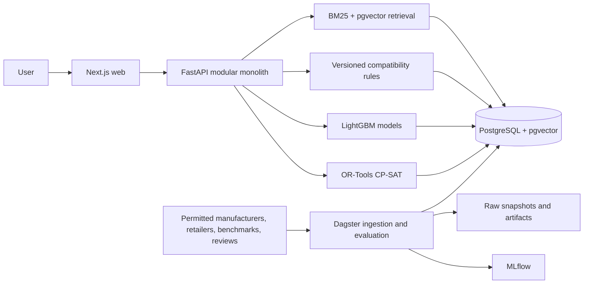

# System design

Status: implementation baseline; interfaces may evolve through migrations  
Last updated: 2026-07-23

## Design decisions

The system is a modular monolith: one Next.js application, one FastAPI process, one PostgreSQL
database with pgvector, one Dagster code location, and one installable Python core package. This
keeps transactions and versioning simple at the expected scale while maintaining explicit module
boundaries. Kafka, Kubernetes, separate model services, and a separate vector database are not
justified until measurements demonstrate a bottleneck.

Compatibility filtering runs before ranking and optimisation, and its result is never delegated
to a language model. Observed performance evidence has priority over model estimates. CP-SAT owns
final combinatorial selection; component rank scores are inputs, not permission to violate a hard
constraint.

## Context and containers

Default Docker Compose services are PostgreSQL, API, and web. `pipeline` adds Dagster; `mlops`
adds MLflow. The optional profiles keep ordinary application startup light. The API applies
Alembic migrations before serving and waits for a healthy database. Container health checks are
service-local and do not depend on third-party connectivity.

The separate production Compose contract does not reuse those local defaults. It provisions
distinct PostgreSQL roles/databases, runs application and MLflow migrations as one-shot release
jobs, separates Dagster webserver/daemon/gRPC code processes, uses PostgreSQL Dagster metadata,
binds operator endpoints to loopback, enforces resource/PID/log limits and read-only application
filesystems, and adds optional Prometheus, blackbox, PostgreSQL-exporter, and recovery profiles.
An external TLS/OIDC ingress and off-host encrypted backups remain deployment responsibilities.
See `docs/deployment-runbook.md` for the complete trust and rollback boundary.

## Module boundaries

| Boundary | Responsibility | Must not decide |
| --- | --- | --- |
| `catalog` | Domain and persistence contracts, canonical products, listings, provenance | Relevance or compatibility |
| `entity_resolution` | Blocking, pair features, conservative duplicate probability, review queue | Build selection |
| `retrieval` | Release-bound BM25 online, embeddings, pgvector search, RRF, candidate recall; PostgreSQL FTS diagnostic fallback | Hard compatibility |
| `performance_models` | Workload-specific observed/predicted scores and confidence | Whether missing data is compatible |
| `ranking` | Query-grouped features and component ordering | Feasibility |
| `compatibility` | PASS/FAIL/WARNING/UNKNOWN versioned rules and evidence | Soft preference value |
| `optimizer` | Budget, exact selection, feasibility, profile objectives, diversity | Source truth |
| `pricing` | Current/median/percentile/volatility labels | Future price promises |
| `reviews` | Permitted aspect evidence with citations | Generic unsupported sentiment |
| `explanations` | Render already-computed reasons and evidence | Invent facts or override rules |
| `annotation` | OIDC-bound reviewer roles, blinded leases, immutable judgments/adjudication, frozen label exports | Infer a label or self-authorize data rights |
| `services/api` | Validation, orchestration, persistence, versioned responses | Hidden business logic in routes |
| `pipelines` | Immutable acquisition, parsing, quality, training, evaluation | Serving mutable unversioned models |

## Online recommendation sequence

1. FastAPI validates the structured request; natural language must already be represented in the
   same inspectable schema.
2. The production retrieval layer scores the immutable, manifest-validated search corpus with
   BM25 and searches pgvector in one read-only database snapshot, fuses ranks with RRF, then
   applies direct structured filters. The database determines the active, release-matched IDs that
   BM25 may score, so stock, price, brand, and specification constraints are never stale index
   metadata. PostgreSQL `ts_rank_cd` remains an explicit diagnostic fallback, not the production
   BM25 implementation.
3. Compatibility evaluates candidates against retained parts and known requirements. FAIL is
   removed. Hard UNKNOWN is retained only for an explicit infeasibility or warning path, not
   silently called compatible.
4. Observed benchmarks are selected from comparable benchmark contexts. When absent, a
   versioned workload regressor may provide a predicted score with confidence.
5. The ranker scores remaining products using retrieval, workload, price, availability, quality,
   freshness, and preference features.
6. CP-SAT selects one item in each required category subject to budget, stock, retained parts,
   feature requirements, pairwise compatibility, clearances, connectors, and power headroom.
7. Each objective profile is solved with integer-normalised scores. Diversity constraints require
   later solutions to differ in at least two meaningful components.
8. The response persists the request/build and emits data, ranking-model, rule, and optimiser
   status/version fields. Explanations render stored decisions and evidence.

Product-price responses separately summarize rights-eligible stored observations. The summary is
explicitly descriptive: current delivered price, 30/90-day medians, 90-day percentile/recent low/
volatility, observed seller/stock trends, history sufficiency, and robust anomaly flags. Sparse
history withholds percentile/volatility. Analysis is bounded to the newest 10,000 observations and
never forecasts or promises a live/future price.

Candidate caps are operational guardrails, not quality claims: 30 CPU, 30 GPU, 50 motherboard,
40 memory, 40 storage, 40 PSU, 30 cooler, and 30 case candidates by default. Recall and solver
latency must be measured before changing them.

## Data and persistence

The initial Alembic migration creates canonical products, retailer listings, price snapshots,
benchmarks, provenance, rules, review evidence, queries, builds, components, and interactions. It
also creates:

<!-- TODO: sections below still to be written. -->
